# Informe

> Informe de la tarea de análisis del laboratorio 4 de Redes y Sistemas Distribuidos - Primer cuatrimestre, FAMaF 2022.

# Integrantes

- Carrizo, Ernesto.
- Domínguez, Agustín.
- Vispo, Valentina.

---

**[ENUNCIADO](../Markdown/Assignment.md) | [README](../README.md)**

---

## Contenido

- [Abstract](#abstract)
- [Modelo de anillo](#modelo-de-anillo)
- [Algoritmo original](#algoritmo-original)
  - [Hipótesis generales sobre el algoritmo](#hipótesis-generales-sobre-el-algoritmo)
  - [Caso I: Dos nodos envían paquetes](#caso-i-dos-nodos-envían-paquetes)
    - [Hipótesis sobre el caso I](#hipótesis-sobre-el-caso-i)
    - [Resultados](#resultados)
  - [Caso II: Todos envían paquetes](#caso-ii-todos-envían-paquetes)
    - [Hipótesis sobre el caso II](#hipótesis-sobre-el-caso-ii)
    - [Resultados](#resultados-1)
  - [Caso III: Random](#caso-iii-random)
    - [Hipótesis sobre el caso III](#hipótesis-sobre-el-caso-iii)
    - [Resultados](#resultados-2)
  - [Conclusión](#conclusión)
- [Algoritmo 1: Selective Flood](#algoritmo-1-selective-flood)
  - [Suposiciones](#suposiciones)
  - [Pasos del algoritmo](#pasos-del-algoritmo)
    - [Hipótesis generales sobre el algoritmo](#hipótesis-generales-sobre-el-algoritmo-1)
  - [Caso I: Dos nodos envían paquetes](#caso-i-dos-nodos-envían-paquetes-1)
    - [Hipótesis sobre el caso I](#hipótesis-sobre-el-caso-i-1)
    - [Resultados](#resultados-3)
  - [Caso II: Todos envían paquetes](#caso-ii-todos-envían-paquetes-1)
    - [Hipótesis sobre el caso II](#hipótesis-sobre-el-caso-ii-1)
    - [Resultados](#resultados-4)
  - [Caso III: Random](#caso-iii-random-1)
    - [Hipótesis sobre el caso III](#hipótesis-sobre-el-caso-iii-1)
    - [Resultados](#resultados-5)
  - [Conclusión](#conclusión-1)
- [Algoritmo 2: Chained Hello](#algoritmo-2-chained-hello)
  - [Suposiciones](#suposiciones-1)
  - [Pasos del algoritmo](#pasos-del-algoritmo-1)
    - [Hipótesis generales sobre el algoritmo](#hipótesis-generales-sobre-el-algoritmo-2)
  - [Caso I: Dos nodos envían paquetes](#caso-i-dos-nodos-envían-paquetes-2)
    - [Hipótesis sobre el caso I](#hipótesis-sobre-el-caso-i-2)
    - [Resultados](#resultados-6)
  - [Caso II: Todos envían paquetes](#caso-ii-todos-envían-paquetes-2)
    - [Hipótesis sobre el caso II](#hipótesis-sobre-el-caso-ii-2)
    - [Resultados](#resultados-7)
  - [Caso III: Random](#caso-iii-random-2)
    - [Hipótesis sobre el caso III](#hipótesis-sobre-el-caso-iii-2)
    - [Resultados](#resultados-8)
  - [Conclusión](#conclusión-2)
  - [Mejoras posibles](#mejoras-posibles)
- [Punto Estrella](#punto-estrella)
- [Referencias](#referencias)

# Abstract

En este laboratorio se estudia el comportamiento de una red representada en un modelo de anillo de 8 nodos, unidos con dos posibles vecinos por el modelo full-dúplex. Cada nodo está formado por dos capas de enlace, una de red y una de aplicación.

La capa de enlace y la capa de aplicación tienen generadores de tráfico y bufferes respectivamente.

Un escenario se envía desde 2 nodos con igual distancia al nodo de destino y en otro todos los nodos, exceptuando el destinatario, envían paquetes, resultando así en diferentes distancias al nodo de destino.

Posteriormente se realizó dos diseños e implementaciones de algoritmos de enrutamiento basados en esta red de anillo y se estudió la efectividad en dichos escenarios.

# Modelo de anillo

Una red de anillo es una topología de red en la que cada nodo se conecta exactamente con dos nodos, formando así una única ruta continua.

# Algoritmo original

## Hipótesis generales sobre el algoritmo

Este algortimos no realiza ninguna evaluación sobre el paquete ni sobre la topología de la red, solo comprueba si el nodo actual es el destino, en cuyo caso que así lo sea lo envía a la capa de aplicación, en caso contrario envía el paquete siempre hacia la línea en sentido horario del nodo.

Esto puede provocar a simple vista un completa falta de uso de la característica `full-duplex` de la red, en dirección opuesta hacia donde se mandan los paquetes.

Como en ninguna circunstancia se envían paquetes en sentido anti-horario, esto provoca un general desuso del ancho de banda de la red.

## Caso I: Dos nodos envían paquetes

> El `nodo 0` y `nodo 2` envían paquetes al `nodo 5`

### Hipótesis sobre el caso I

En este caso, se puede contemplar que el nodo 2 congestionará inecesariamente el lado derecho del anillo, ya que existe un una mejor ruta. En particular aumentando el uso de los buffers del `nodo 0` el cual es un punto donde se encuetran los paquetes generados por el nodo 2 y del mismo `nodo 0`.

Esto provocara un aumento del delay medio de los paquetes cuando llegan a destino (Nodo 5).

### Resultados

| Intervalo | N° Packets | Avg. Delay | Hops Mean |
|-----------|------------|------------|-----------|
| 0.5       | 198        | 72.95      | 3.62      |
| 1         | 197        | 50.89      | 3.62      |
| 2         | 188        | 7.96       | 3.62      |

En el siguiente gráfico se puede ver el estado de los buffer de los link internos de la red:

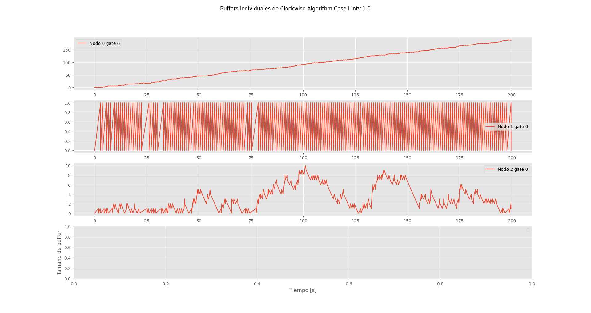
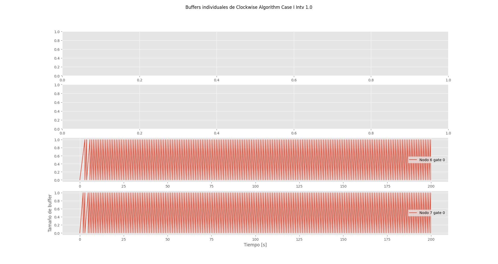

Apreciar que solo hay lineas rojas representando los la salidas `0` de cada capa de red (las salidas que van a sentido del reloj), lo cual confirma la hipótesis de utilización de la red.

## Caso II: Todos envían paquetes

> Todos los nodos menos el 5 envían paquetes al `nodo 5`

### Hipótesis sobre el caso II

En este caso, se nota de manera más evidente la congestión de la red, ya que todos los nodos envían en sentido horario incluso el nodo que esta a un solo un salto del destino.

Esto aumentará el delay medio de todos los paquetes enviados por los distintos nodos, viéndose los más afectados los del `nodo 4`, el cual es el nodo en inmediatamente después (en sentido horario) del `nodo 5`.

### Resultados

| Intervalo | N° Packets | Avg. Delay | Hops Mean |
|-----------|------------|------------|-----------|
| 0.5       | 200        | 72.82      | 1.5       |
| 1         | 200        | 64.21      | 2         |
| 2         | 200        | 56.61      | 3         |

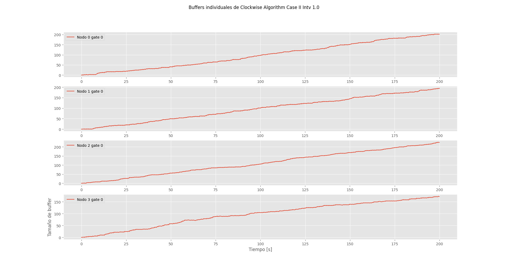
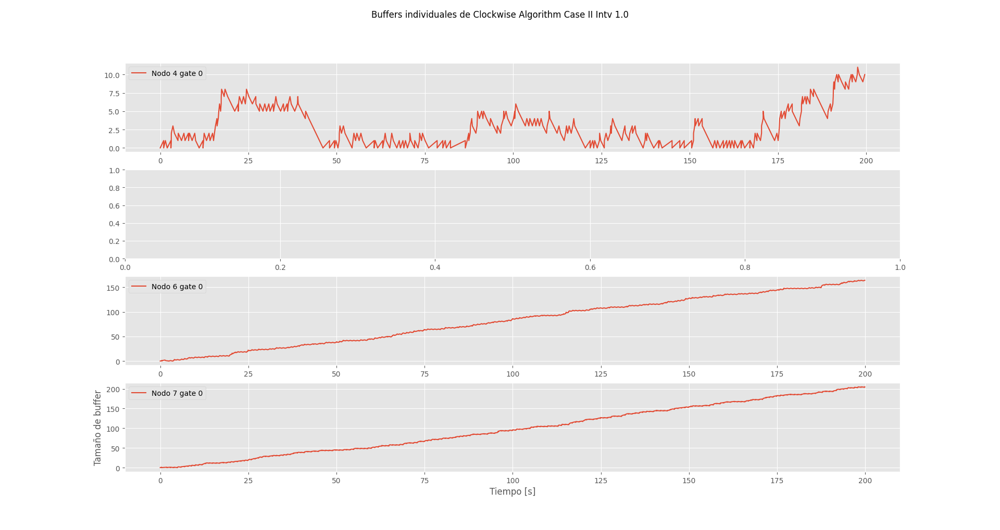

Se nota que incluso en los casos de ocupación menor de la red (intervalo 2) el delay de la misma es mucho más grande que en el caso I.

Igual que en el caso anterior, todas las conexiones full-duplex son usadas al 50% como máximo.

## Caso III: Random

> Cada paquete puede enviar paquetes a cualquier otro siguiendo una distribución uniforme

### Hipótesis sobre el caso III

En este caso, al ser aleatorio, lo único que se puede asegurar es el desuso de la característica full-duplex de la red. La acumulación de los buffers en dirección del sentido del reloj (`gates 0`) deberían ser muy similar en todas las conexiones de la red.

### Resultados

| Intervalo | Hops Mean |
|-----------|-----------|
| 0.5       | 0.61      |
| 1         | 2.23      |
| 2         | 2.37      |

Estos datos serán relevantes de comparar con los demás algoritmos.

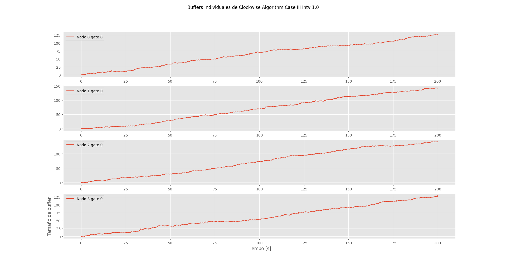
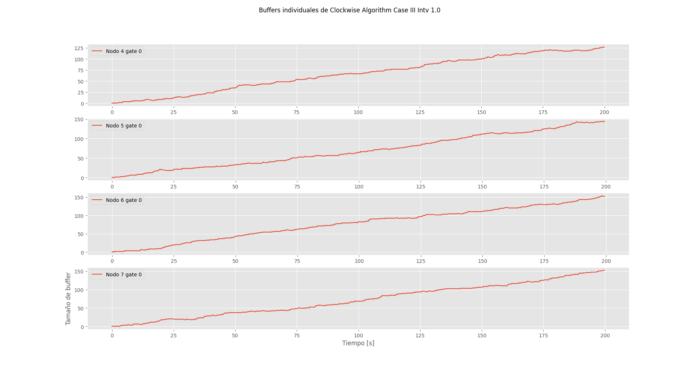

Se puede visualizar la confirmaición de nuestra hipótesis sobre la regularidad de acumulación de paquetes en el buffer en todos los enlaces hacia sentido del reljo.

## Conclusión

El algoritmo es muy simple pero desperdicia toda un sentido de la red y en muchos casos toma el camino más largo posible para llegar a un nodo.

# Algoritmo 1: Selective Flood

## Suposiciones

- Topología de anillo.
- La topología del anillo no se modifica.
- Los nodos pueden estar en cualquier orden.
- **Se sabe la cantidad de nodos en el anillo.**

## Pasos del algoritmo

1. Cuando un `nodo x` *(nodo de origen)* necesita mandar un paquete a un destino `nodo y`, se inicializa el contador de saltos (`hoops`) en 0 y envía el paquete a sus 2 vecinos, generando así un paquete en sentido anti-horario y otro en sentido horario.

2. Por cada nodo que se recibe el paquete, si no es el destino, el hoops aumenta en uno y se compara el valor de este:
    - Si `hoops < 4` => se pasa al siguiente nodo.
    - Si `hoops >= 4` => se descarta ese paquete.
    > `Cantidad máxima de hoops = cantidad de nodos / 2 = 4`

Este proceso ocurre sucesivamente hasta encontrar el nodo de destino `y`.

3. Cuando el paquete llega al nodo de destino `y`.

La *cantidad de máxima de hoops* permite que la inundación utilice los mínimos recursos posibles mientras también se garantiza que un paquete llegue a cualquier destino del anillo.

### Hipótesis generales sobre el algoritmo

En este algortimo se utiliza la idea de inundación selectiva, esto provoca una mejora significativa en el *delay medio* de los paquetes, ya que no solo se tiene en cuenta la ruta en sentido horario sino también en sentido anti-horario, esto implicará un aprovechamiento de los canales `full-duplex`.

De la misma manera, congestionará la red por mera naturaleza de la inundación, aumentando así la utilización de los buffers de todos los nodos.

Comparando con el algortimo original habrá una mínima mejora en la congestión o ninguna, dependiendo el caso, gracias a la característica de los paquetes de ser eliminados después de cierta cantidad de saltos.

## Caso I: Dos nodos envían paquetes

> El `nodo 0` y `nodo 2` envían paquetes al `nodo 5`

### Hipótesis sobre el caso I

En comparación con el `caso I` del algoritmo original se notará una **mejora en el delay medio** de los paquetes enviados desde el `nodo 2` ya que se tomará la mejor ruta, la cual es la anti-horaria hacia el `nodo 5`.

### Resultados

| Intervalo | N° Packets | Avg. Delay | Hops Mean |
|-----------|------------|------------|-----------|
| 0.5       | 266        | 67.03      | 3         |
| 1         | 207        | 48.34      | 3         |
| 2         | 189        | 7.06       | 3         |

Como los hops se calculan cuando el paquete llega al destino y la inundación garantiza que al menos un paquete tome la ruta óptima, se explica por qué la media de saltos es siempre el valor mímimo de 3.

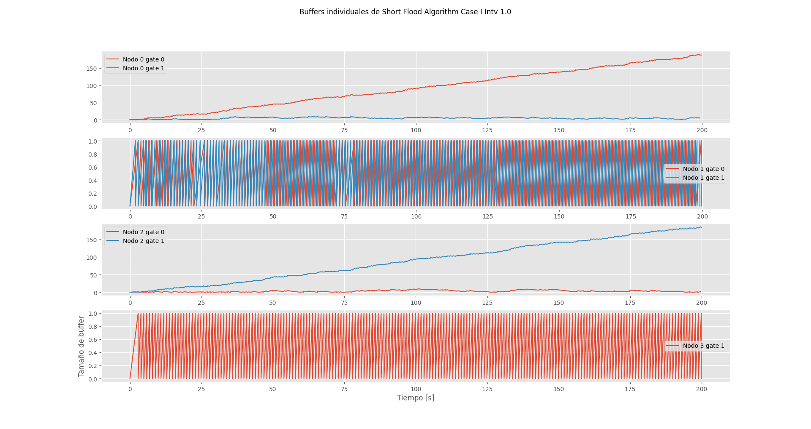
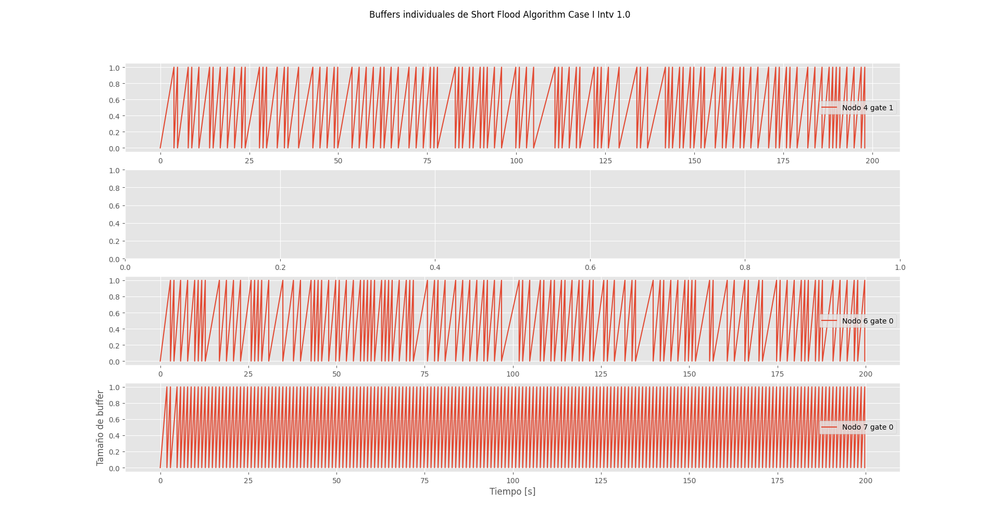

## Caso II: Todos envían paquetes

> Todos los nodo menos el 5 envían paquetes al `nodo 5`

### Hipótesis sobre el caso II

En este caso se contempla significativamente la mejora en el delay medio de los paquetes enviados por los nodos de la mitad izquierda del anillos (Nodos 1, 2, 3 y 4), debido a que seleccionan la mejor ruta hacia su destino.

### Resultados

| Intervalo | N° Packets | Avg. Delay | Hops Mean |
|-----------|------------|------------|-----------|
| 0.5       | 399        | 73.23      | 1.47      |
| 1         | 399        | 62.91      | 1.80      |
| 2         | 396        | 43.09      | 2.13      |

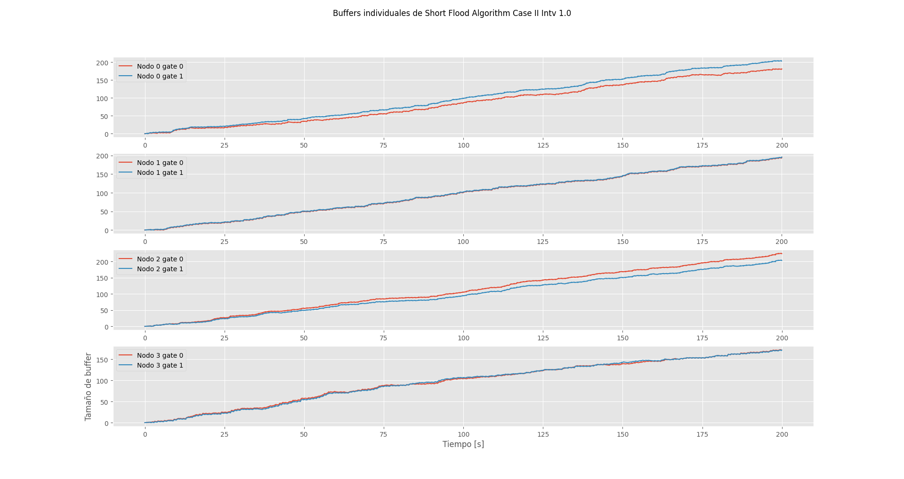
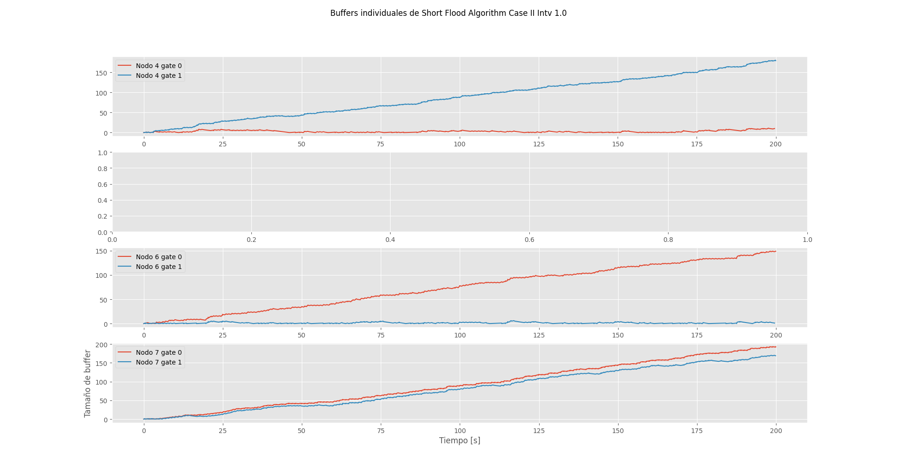

## Caso III: Random

> Cada paquete puede enviar paquetes a cualquier otro siguiendo una distribución uniforme

### Hipótesis sobre el caso III

En comparación con el algoritmo original, todos los paquetes tomarán la mejor ruta a cualesquiera sea su destino.

El problema en este caso es el aumento de la congestión de la red el cual podría provocar o no aumento del delay medio de los paquetes.

### Resultados

| Intervalo | Hops Mean |
|-----------|-----------|
| 0.5       | 0.83      |
| 1         | 1.33      |
| 2         | 1.86      |

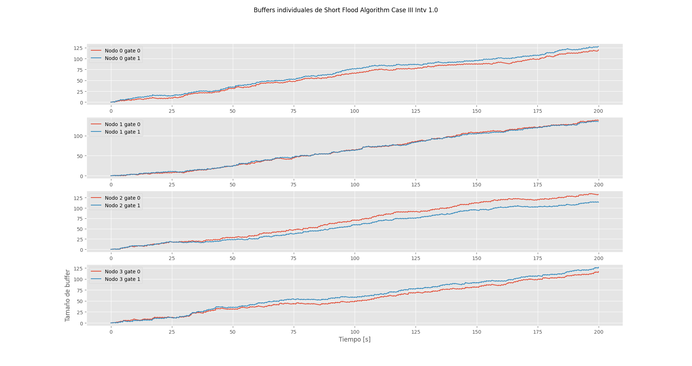
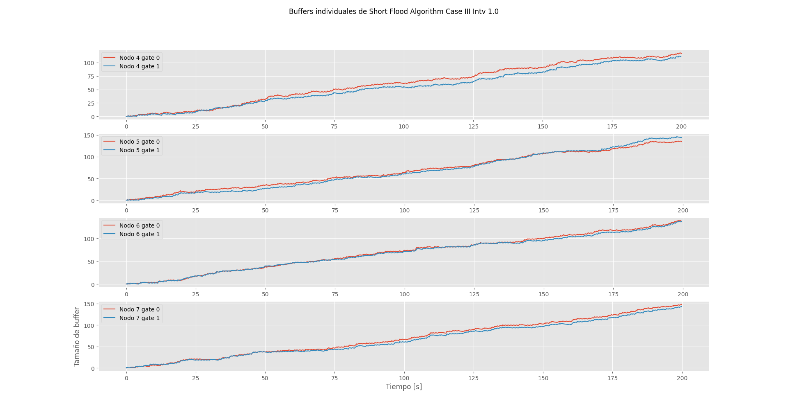

## Conclusión

- Mayor utilización del ancho de banda.
- Mayor velocidad en el envío de paquetes.
- Problemas cuando la cantidad de nodos es par porque el nodo de destino recibe dos paquetes en vez de uno.

# Algoritmo 2: Chained Hello

## Suposiciones

- Topología de anillo.
- La topología del anillo no se modifica.
- Los nodos pueden estar fuera de orden.
- El anillo podría tener cantidad arbitraria de nodos.
- **Se sabe la cantidad de nodos en el anillo.**

## Pasos del algoritmo

1. Existe un `nodo x` que es el encargado de iniciar la cadena de HELLO, (en nuestro caso lo definimos como el nodo 0). Este `nodo x` envía quién es (su index) y se lo pasa al vecino que tiene en sentido horario con un *mensaje hello de listas enlazadas*.

> `hello = [nodo[x]]`

2. Luego el vecino en sentido horario del `nodo x`, el `nodo a`, anota quién es y se lo pasa a su vez a *su* vecino en sentido horario, `nodo b`.
    - Este proceso ocurre sucesivamente.

> `hello = [nodo[x], nodo[a], nodo[b], ...]`

1. Cuando el `nodo x` *(nodo origen de los mensajes hello)* recibe el mensaje, vuelve a anotarse, se da cuenta que él es el inicio y fin de la lista, lo cual indica que la lista está finalizada (se cerró la red de anillo).

> `hello = [nodo[x], nodo[a], nodo[b], ..., nodo[x]]`

4. El `nodo x` debe inundar la red con la lista finalizada para informar la topología de la misma. Inunda la red envíando un paquete con dicha información en ambas direcciónes (ambos vecinos del `nodo x` reciben el paquete).

5. Cada nodo recibe la información de la topología de la red y calcula la mejor ruta para cada nodo. Si ya tiene la topología guardada, ignora el paquete y no lo retransmite (esto corta la inundación cuando ya todos tengan la información).

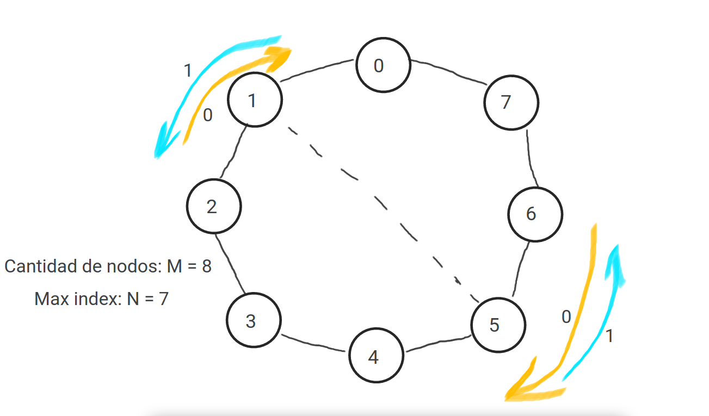
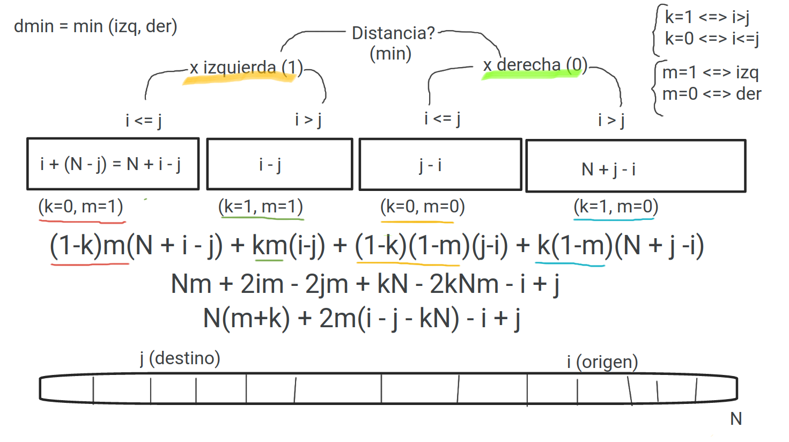

### Hipótesis generales sobre el algoritmo

Este algoritmo es el mejor comparado con los 2 anteriores debido a que no solo que utiliza la característica full-duplex de las líneas, si no que también la usa de manera más eficiente.

Esto implica que se dejará de congestionar la red de manera masiva (como lo hacía la inundación selectiva), mejorando así significativamente el delay medio de los paquetes. Entonces se puede dejar de utilizar la cantidad de saltos como medida de control ya que siempre se enviarán por la mejor ruta, solo se utilizarán como medida de estudio.

Este algortimo provoca un *mínimo overhead* con la inundación de los paquetes `Hello`, el cual en nuestro caso de estudio no lo provoca ya que el intervalo de generación es `1` y el reconocimiento topológico de la red se realiza antes de que el primer paquete de datos se genere.

## Caso I: Dos nodos envían paquetes

> El `nodo 0` y `nodo 2` envían paquetes al `nodo 5`

### Hipótesis sobre el caso I

En este caso, se logrará el enrutamiento óptimo para ambos nodos dando así un delay medio ligeramente mejor al del algortimo de inundación selectiva pero sin la contraparte de  congestionar la red.

### Resultados

| Intervalo | N° Packets | Avg. Delay | Hops Mean |
|-----------|------------|------------|-----------|
| 0.5       | 395        | 51.00      | 3         |
| 1         | 380        | 6.88       | 3         |
| 2         | 197        | 3.39       | 3         |

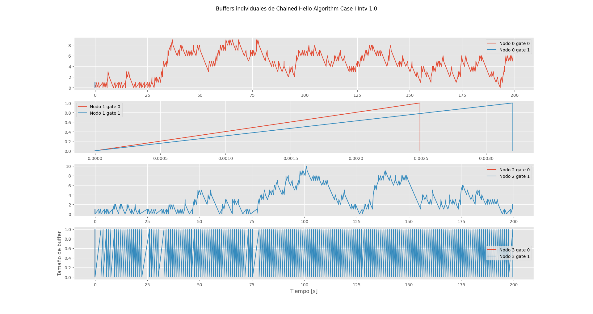
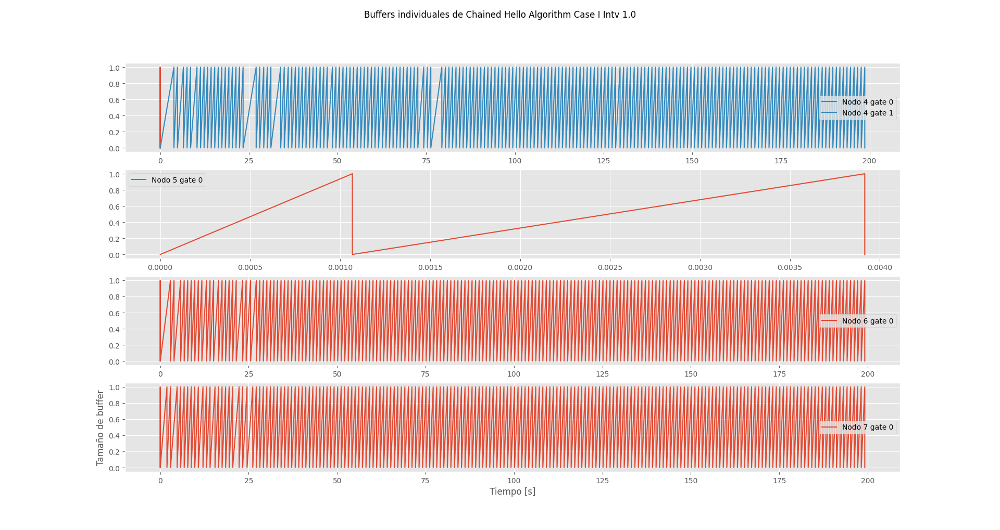

## Caso II: Todos envían paquetes

> Todos los paquetes menos el 5 envían paquetes al `nodo 5`

### Hipótesis sobre el caso II

Mejorarán los delay medios de todos los paquetes de la red así como la disminución del uso de buffers.

Aunque este es el peor caso de la red ya que se sobrecarga bastante la dirección hacia el 5. Si bien el algoritmo carga lo menos posible la red, la naturaleza del caso hace que haya acumulación de buffers y retraso mayor que en los demás casos.

### Resultados

| Intervalo | N° Packets | Avg. Delay | Hops Mean |
|-----------|------------|------------|-----------|
| 0.5       | 399        | 73.82      | 1.48      |
| 1         | 399        | 63.50      | 1.87      |
| 2         | 397        | 41.75      | 2.19      |

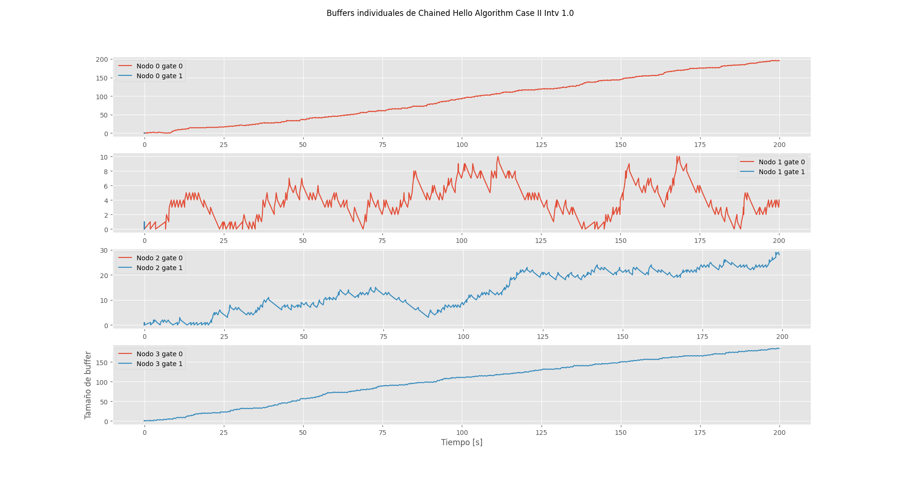
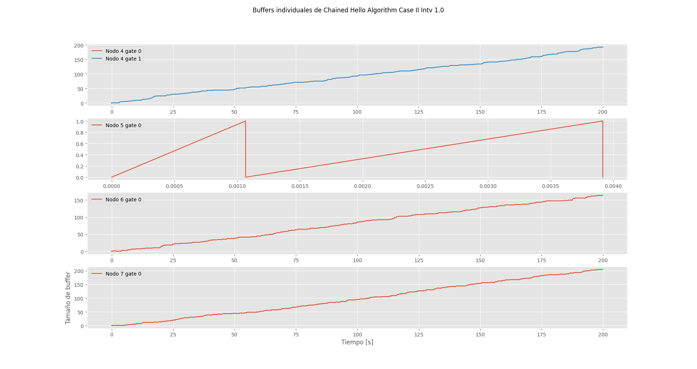

## Caso III: Random

> Cada paquete puede enviar paquetes a cualquier otro siguiendo una distribución uniforme

### Hipótesis sobre el caso III

Ya que este algortimo es óptimo para esta red, los paquetes siempre se enviarán por la mejor ruta sin provocar congestión.

A diferencia del caso anterior, la naturaleza random de los destinos hace que la carga total de paquetes se distribuya más equitativamente en las conexiones full-duplex de la red, lo cual debería dar mejores resultados que el caso II.

### Resultados

| Intervalo | Hops Mean |
|-----------|-----------|
| 0.5       | 1.41      |
| 1         | 1.88      |
| 2         | 1.89      |

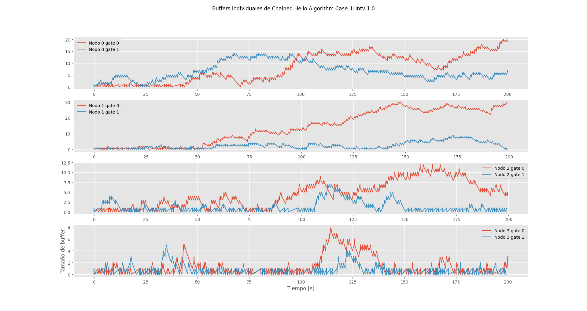
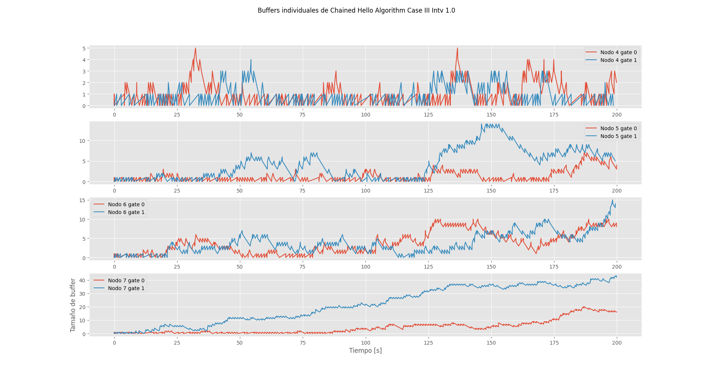

## Conclusión

- Una vez conocida la topología de la red siempre se envía por la mejor ruta.
- No se presenta el problema si la cantidad de nodos es impar o par a diferencia del algoritmo "Selective Flood".
- La inundación de la topología no es muy costosa respecto al uso de la red.
- En el caso random no hay acumulación de buffers, que sí ocurre en los demás algoritmos de enrutamiento.

## Mejoras posibles

- Poder responder a cambios en la topología de la red: cuando se cae un nodo.
- Que no sea necesario conocer de antemano la cantidad de nodos.
  > Debido a problemas con las métricas no pudimos poner tiempo en resolver esto.
  La idea era tener una *lista enlazada* en los hello entonces cada uno puede agregar al paquete su nombre, entonces no haría falta tener de ninguna forma el número de nodos de antemano.

---

# Punto Estrella

Si se deseara implementar el punto estrella, el algoritmo de enrutamiento debería funcionar en cualquier topología de red. En nuestro caso ninguno de nuestros algoritmos de enrutamiento funcionaría porque dependenmos fuertemente de la topología inicial (anillo) y también de que esta topología no se altere durante la vida de la red.

También sería necesario utilizar nuevas métricas para corrobar varias funcionalidades de este nuevo algoritmo:

- ¿Cómo mostrar un estadística de cuando un nodo se cae/agrega?

# Referencias

- [1] Tanenbaum A. S. (2012). Redes de computadores (5ta ed.) Pearson.
- [2] https://es.wikipedia.org/wiki/Red_en_anillo

---

**[ENUNCIADO](../Markdown/Assignment.md) | [README](../README.md)**

---