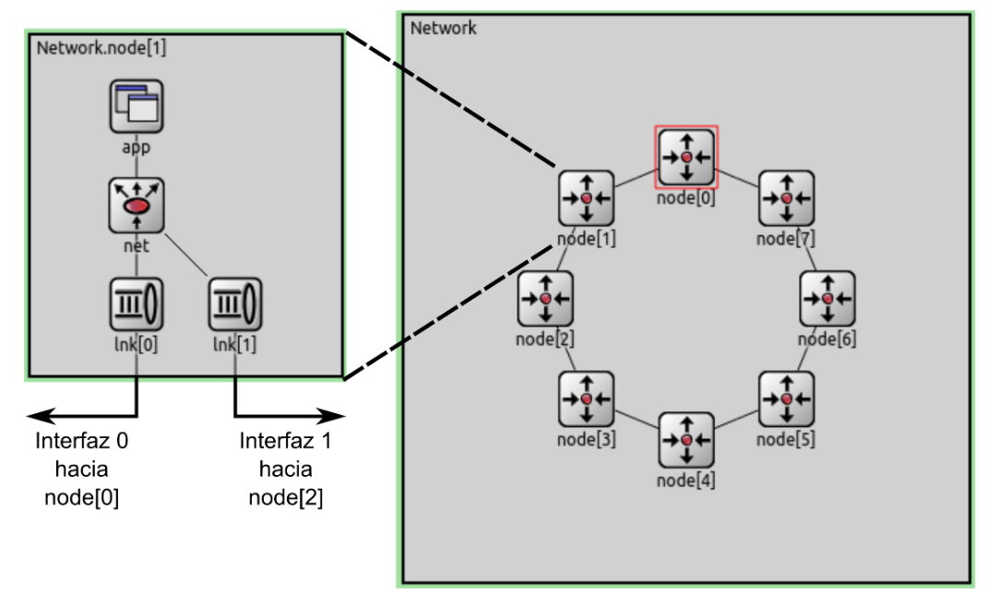
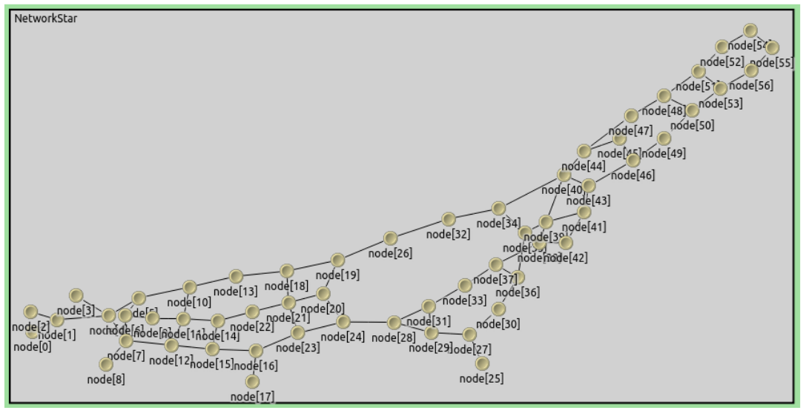

# Enunciado

---

**[README](../README.md) | [ANÁLISIS](../Markdown/Analysis.md)**

---

# Laboratorio 4: Red

# Tabla de contenidos
- [Modelo de Anillo](#modelo-de-anillo)
- [Tarea Análisis](#tarea-análisis)
  - [Experimentos y Preguntas](#experimentos-y-preguntas)
- [Tarea Diseño](#tarea-diseño)
- [Tarea Estrella](#tarea-estrella)
- [Requisitos de la Entrega](#requisitos-de-la-entrega)

> Cátedra de Redes y Sistemas Distribuidos

# Modelo de Anillo
Se entrega como kickstarter un modelo de red en anillo que consta de 8 nodos, cada uno con 1 dos interfaces de comunicación full-duplex con dos posibles vecinos.



Internamente, cada nodo cuenta con dos capas de enlace (link o lnk, una con cada vecino), una capa de red (net) y una capa de aplicación (app). La capa de aplicación y la capa de enlace implementan generadores de tráfico y buffers respectivamente, tal como se usaron en el laboratorio de capa de transporte.

Conceptualmente, la novedad de este laboratorio es el rol de la capa de red, que deberá decidir por qué interface enviar los paquetes que le llegan ya sea desde la capa de aplicación superior o desde las capas de enlaces inferiores. En otras palabras, estaremos trabajando en el problema de enrutar el tráfico que confluye en este módulo de múltiples entradas y salidas.

---

[1] Las topologías anillo han sido, son y serán muy utilizadas en diferentes tipos de redes.

[2] Full-duplex quiere decir que el canal puede transmitir información en ambos sentidos al mismo tiempo.

---

En particular, la capa de red entregada en el kickstarter no reviste de mayor inteligencia. Cada paquete que ésta recibe es evaluado para determinar si el nodo local es el destino final del mismo. En caso de que lo sea, el paquete es enviado a la capa de aplicación local. En caso de que el paquete esté destinado a otro nodo se elige una interface para re-transmitirlo. La capa de red del kickstarter elige siempre la interface número 0 (`toLnk[0]`) que es la que envía el tráfico en sentido de las manecillas del reloj a lo largo del anillo hasta llegar al destino.

```cpp
void Net:.handleMessage(cMessage *msg) {
    // All msg (events) on net are packets
    Packet *pkt = (Packet *) msg;

    // If this node is the final destination, send to App
    if (pkt->getDestination() == this->getParentModule()->getIndex()) {
        send(msg, "toApp$o");
    }

    // If not, forward the packet to some else... to who?
    else {
        // We send to link interface #0, which is the
        // one connected to the clockwise side of the ring
        // Is this the best choice? Are there others?
        send(msg, "toLnk$o", 0);
    }
}
```

# Tarea Análisis
Se pide incluir en el modelo dado todas las estadísticas necesarias para analizar el rendimiento del sistema de enrutamiento planteado. En particular se sugiere incluir medidas de demora de entrega de paquetes, cantidad de saltos utilizados por cada paquete, utilización de los recursos de la red (buffers y **enlaces**), entre otros que el alumno crea conveniente.

## Experimentos y **Preguntas**
1. **[Caso 1]** Se deberá correr el modelo con las fuentes de tráfico configuradas (`node[0]` y `node[2]` transmitiendo datos a `node[5]`) y estudiar las métricas tomadas.
    - ¿Qué métricas se obtienen?
    - ¿Cómo es el uso de los recursos de la red? ¿Se puede mejorar?
2. **[Caso 2]** Asuma ahora que todos los `nodos (0, 1, 2, 3, 4, 6, 7)` generan tráfico hacia el `node[5]` con `packetByteSize` e `interArrivalTime` idénticos entre todos los nodos.
    - Explore y determine a partir de qué valor de `interArrivalTime` se puede garantizar un equilibrio o estabilidad en la red. Justifique.

```cpp
Network.node[{0, 1, 2, 3, 4, 5, 6, 7}].app.interArrivalTime = exponential(1)
Network.node[{0, 1, 2, 3, 4, 5, 6, 7}].app.packetByteSize = 125000
Network.node[{0, 1, 2, 3, 4, 5, 6, 7}].app.destination = 5
```

# Tarea Diseño
Se pide diseñar una estrategia de enrutamiento que supere a la planteada en el kickstarter. Queda a libre elección del alumno que información este nuevo algoritmo de enrutamiento pueda tomar, así de cómo cada nodo llegará a obtener la misma [3].****

1. Evalúe y compare su estrategia con los casos 1 y 2 de la tarea de análisis [4].
    - ¿Cuánto 4 mejoran las métricas? ¿Por qué?
    - ¿Hay loops de enrutamiento? Más allá de lo que llegó a implementar en el simulador, ¿Ve alguna manera de mejorar más aún su diseño?

# Tarea Estrella
Opcionalmente, y por puntos extra en el parcial, se pide diseñar una estrategia de enrutamiento más general. En particular, la misma debe adaptarse a cualquier topología y cantidad de interfaces por nodo [5].



El diseñador es libre de evaluar su algoritmo en las condiciones de tráfico que considere siempre y cuando justifique y discuta en el informe qué desafíos y problemas ha debido superar para llegar al estado actual del algoritmo de enrutamiento propuesto.

---

[3] Ni en la tarea de diseño ni en la tarea estrella se deberán usar funciones de simulación Omnet++ (i.e., cTopology, iteradores de cGate ) para descubrir nodos vecinos. En cambio, se deberán aprovechar paquetes echo/hello como los que se usan en redes reales.

[4] De ser necesario para un mejor funcionamiento de su algoritmo, reduzca el tamaño de los paquetes a `12500 Bytes` y aumente su tasa de generación a `exponential(0.1)` (en el kickstarter están configurados `125000 Bytes` y `exponential(1)` respectivamente).

[5] El caso del anillo sólo considera dos interfaces por nodo, ahora esto se deberá generalizar a N interfaces. Inclusive, se deberá considerar que en un nodo determinado existan capas de enlace que no estén conectadas con nada (gates desconectadas). En particular, el código deberá testear qué interfaces se encuentran activas en el nodo.

Como banco de pruebas se provee un `networkStar` dentro archivo `.ned` del kickstarter. También se sugiere probar y comparar el algoritmo en la topología de anillo.

# Requisitos de la Entrega

- El código debe ser claro y contener comentarios con detalles de lo que hicieron.
- Se solicita un informe en el que se presenten los análisis de los experimentos y las respuestas a las preguntas de cada tarea. El informe debe estar escrito en texto plano o Markdown.
- Las entregas serán a través del repositorio Git provisto por la Facultad para la Cátedra, con **fecha límite indicada en el cronograma del aula virtual**.

---

**[README](../README.md) | [ANÁLISIS](../Markdown/Analysis.md)**

---